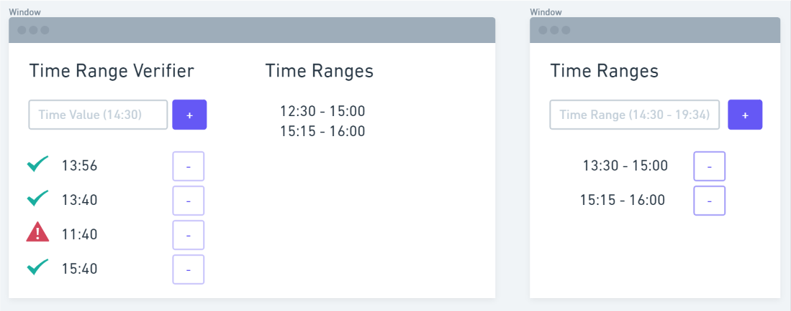

# Test Task Frontend Development

Hello there. Great to have you here! :)

As you probably already know, Mister Spex is Europe‘s largest online optician. And we need you to keep rockin' it!

## Before you start

_At Mister Spex we use and love React as our frontend backbone. We would love to see you using it in action._
_If you have questions, feel free to write us. We love to help._

## Scenario

My application performs various tasks. I can schedule those tasks to run in defined intervals, like every hour or every second day.

Due to load issues, I want to allow the execution of those tasks only in some dedicated time slots. Example: I want to run a task only from 8 am to 12 am and 7 pm to 11 pm.

## Task 🚀

Having this scenario in mind, we can strip down the problem to creating an application which leverages a tiny module/class/function/... to fulfill the following UACs (_User Acceptance Criteria_) .

## User Acceptance Criteria:

The application runs in a browser and allows the following user interactions.

### Add Time Ranges
- reachable with a URL like `/config`
- I can define time ranges (add and remove). Example: "02:00:00-03:00:00", "16:00:00-17:50:59" or "05:00:00-06:00:00"
- The application has a dedicated page to compose a list of time ranges like in the example.

### Validate Time Values Against Time Ranges

- reachable with a URL like `/`
- I can create a list of time values (add and remove).
- A time value is displayed with green check mark if the time value is within the given time ranges.
- A time value is marked if the time value is outside the given time ranges.
- show an immutable list of time ranges if screen width > 640px

## Solution Hints

- this task is supposed to have a simple solution, expect to spend 2-3 hours on it.
- expect this application to grow to a big SPA later.
- implement the necessary code using JavaScript/TypeScript and React
- apply the best software development methods, so you should have quality in mind
- your proposed solution must compile and run, you can attach instructions in a README.
- your source code should be packaged as zip or tar
- elaborate on how to implement SSR

### Follow up

Please make your mind about the following topic, so we can talk about them in the review.

- setup of development environment
- describe software lifecycle
- describe runtime environment

## Thank you so much for your time 😊

_We can't wait to see what you come up with - Team Mister Spex._
